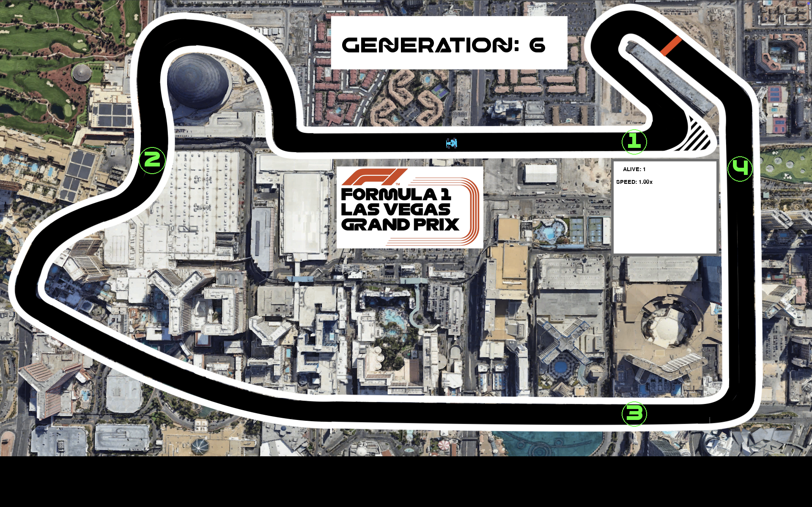

# WORK IN PROGRESS! 


# F1 NEAT Simulation

This project simulates a car racing environment using the NEAT (NeuroEvolution of Augmenting Topologies) algorithm to evolve neural networks that control the cars.

## Screenshot



### What is NEAT?

**NEAT (NeuroEvolution of Augmenting Topologies)** is a type of evolutionary algorithm used to generate artificial neural networks. Unlike traditional neural networks that have a fixed structure, NEAT evolves both the neural network's weights and its architecture over generations. This approach allows it to optimize complex tasks by:

- **Starting Simple:** NEAT begins with minimal networks and gradually adds complexity through mutations, ensuring efficient learning without overfitting.
- **Evolving Topologies:** It not only adjusts connection weights but also changes the network structure by adding nodes and connections over time.
- **Speciation:** NEAT maintains diverse solutions by grouping similar networks into species, allowing new structures to evolve without being immediately outcompeted by more developed ones.

This makes NEAT particularly powerful for solving tasks where the optimal neural network architecture is unknown or highly complex.

## Project Structure

- **src/**: Contains the source code.
  - **assets/images/**: Contains image assets like car sprites and maps.
  - **constants/**: Defines game constants.
  - **input/**: Handles user input.
  - **objects/**: Contains object classes like `Car`.
  - **rendering/**: Handles rendering of the game.
  - **simulation/**: Contains the simulation logic.
  - **state/**: Manages global simulation state.

- **config/**: Contains configuration files for NEAT.

## Setup

1. **Install Dependencies**:
   ```bash
   pip install -r requirements.txt
   ```

2. **Run the Simulation**:
  (WIP: For the time being be sure to run from inside src)
   ```bash
   python main.py
   ```

## Configuration

- **NEAT Configuration**: Modify `config/config.txt` to adjust NEAT parameters like population size, mutation rates, etc.

## Controls

- **ESC**: Quit the simulation.
- **R**: Toggle radar visualization.
- **UP/DOWN Arrows**: Increase or decrease simulation speed.

## Assets

- **Car Image**: Located in `assets/images/car.png`.
- **Map Image**: Located in `assets/images/vegas.png`.
